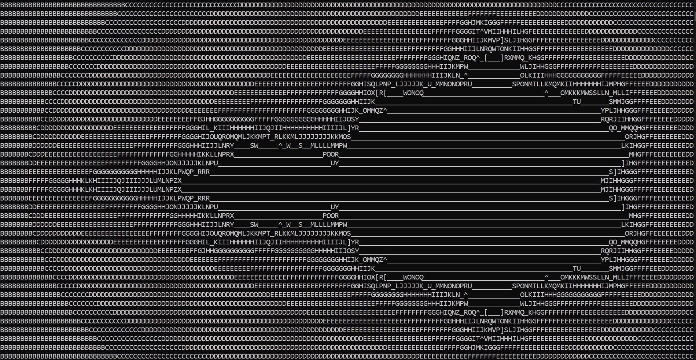

# Mandelbrot

This files can make your cmd display the Mandelbrot set.

## Instructions:

Use _big.py_ to display the Mandelbrot set on your cmd in details.

> [!IMPORTANT]
> This only on windows

Or you could use _tiny.py_ to display a version that fits your terminal's font size.

> [!NOTE]
> Works on every platform

## Demos:

### _big.py_:

### _tiny.py_:

